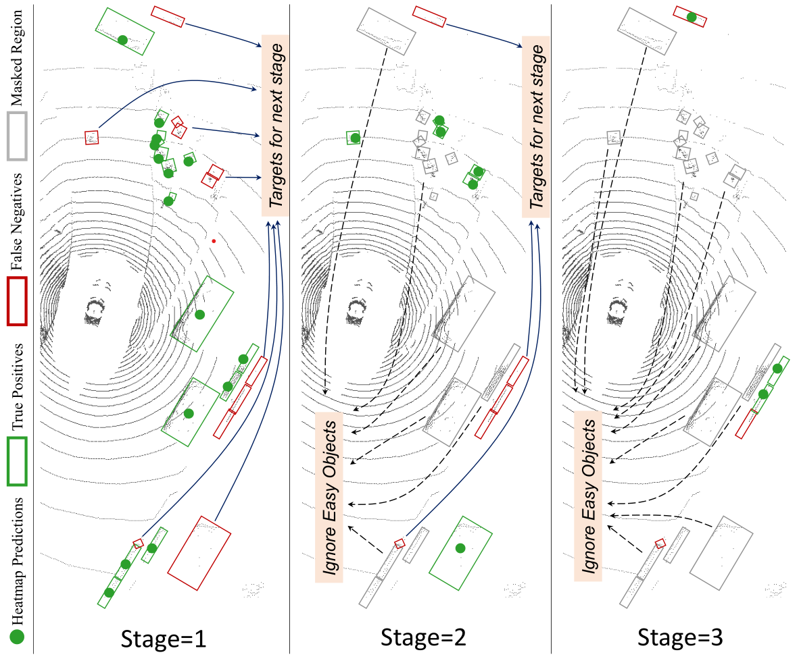

# FocalFormer3D: Focusing on Hard Instance for 3D Object Detection
> **FocalFormer3D: Focusing on Hard Instance for 3D Object Detection**, ICCV 2023.            

> [Yilun Chen](http://yilunchen.com/about/), [Zhiding Yu](https://chrisding.github.io/), [Yukang Chen](https://yukangchen.com/), [Shiyi Lan](https://voidrank.github.io/), [Anima Anandkumar](http://tensorlab.cms.caltech.edu/users/anima/), [Jiaya Jia](https://jiaya.me/), [Jose M. Alvarez](https://alvarezlopezjosem.github.io/)

> [[Paper]](https://arxiv.org/abs/2308.04556)

### Abstract

False negatives (FN) in 3D object detection, {\em e.g.}, missing predictions of pedestrians, vehicles, or other obstacles, can lead to potentially dangerous situations in autonomous driving. While being fatal, this issue is understudied in many current 3D detection methods. In this work, we propose Hard Instance Probing (HIP), a general pipeline that identifies \textit{FN} in a multi-stage manner and guides the models to focus on excavating difficult instances. For 3D object detection, we instantiate this method as FocalFormer3D, a simple yet effective detector that excels at excavating difficult objects and improving prediction recall. FocalFormer3D features a multi-stage query generation to discover hard objects and a box-level transformer decoder to efficiently distinguish objects from massive object candidates. Experimental results on the nuScenes and Waymo datasets validate the superior performance of FocalFormer3D. The advantage leads to strong performance on both detection and tracking, in both LiDAR and multi-modal settings. Notably, FocalFormer3D achieves a 70.5 mAP and 73.9 NDS on nuScenes detection benchmark, while the nuScenes tracking benchmark shows 72.1 AMOTA, both ranking 1st place on the nuScenes LiDAR leaderboard.

### Hard Instance Probing 

<div align='center'>
 
</div>

## News

- **(2023/8/11)** 🔥 We release the code of FocalFormer3D.
- **(2023/7/14)** FocalFormer3D is accepted by ICCV 2023.
- **(2023/5/8)** 🏆 Our single multi-modal fusion model FocalFormer3D-F outshines all other non-TTA approaches on [nuScenes Detection benchmark](https://www.nuscenes.org/object-detection?externalData=all&mapData=all&modalities=Any).
- **(2023/3/10)** 🏆 FocalFormer3D ranks first on [nuScenes LiDAR Detection benchmark](https://www.nuscenes.org/object-detection?externalData=all&mapData=all&modalities=Lidar).
- **(2023/3/10)** 🏆 FocalFormer3D ranks first on [nuScenes LiDAR Tracking benchmark](https://www.nuscenes.org/tracking?externalData=all&mapData=all&modalities=Lidar).


## Results

### 3D Object Detection (nuScenes Detection & Tracking Leaderboard)

|   Model   | Modality | mAP  | NDS | AMOTA  | Result Files |
| :-------: | :------: | :--: | :--: | :--: | :------: |
| FocalFormer3D-F |   C+L    | 72.4 | 74.5 | 73.9 | [Detection](https://drive.google.com/file/d/1Bm3on5SYl1Lu99H_1kyBRTGmQNNnAE-W/view?usp=sharing) / [Tracking](https://drive.google.com/file/d/1YMavHi8M1lx1lrxIQpFdDW3b5ZpiNHQB/view?usp=sharing) |
| FocalFormer3D |   L    | 68.7 | 72.6 | 71.5 | [Detection](https://drive.google.com/file/d/1-kwB-quXllWuYngNPs_ePZIiZK-QaAQK/view?usp=sharing) / [Tracking](https://drive.google.com/file/d/1Bw8ejZ4DVkMilxDf3L9s9dw7q7sZiggN/view?usp=sharing) |
| FocalFormer3D-TTA |   L    | 70.5 | 73.9 | 72.1 | [Detection](https://drive.google.com/file/d/1MuMGJkN2exMtXZlF_86FcMEuW_U9kZYq/view?usp=sharing) / [Tracking](https://drive.google.com/file/d/1ExqGwvP4oAdJtSgwzP2dcbw5rOgPD7Pw/view?usp=sharing) |

### 3D Object Detection (on nuScenes validation set)

|   Model   | Modality | mAP  | NDS  | Checkpoint |
| :-------: | :------: | :--: | :--: | :--------: |
| [FocalFormer3D-F](https://github.com/NVlabs/FocalFormer3D/blob/master/projects/configs/focalformer3d/FocalFormer3D_LC.py) |   C+L    | 70.5 | 73.1 | [FocalFormer3D_LC.pth](https://drive.google.com/file/d/1yJyj7NrGLtj0j_tP3-vU0P0UflA-AmCh/view?usp=sharing) |
| [FocalFormer3D](https://github.com/NVlabs/FocalFormer3D/blob/master/projects/configs/focalformer3d/FocalFormer3D_L.py) |   L    | 66.4 | 70.9 | [FocalFormer3D_L.pth](https://drive.google.com/file/d/1OMj00n_pbAotlGi2JyqptYSgpt6mfyu5/view?usp=sharing) |
| [DeformFormer3D](https://github.com/NVlabs/FocalFormer3D/blob/master/projects/configs/focalformer3d/DeformFormer3D_L.py) |  L   | 65.5 | 70.7 | [DeformFormer3D_L.pth](https://drive.google.com/file/d/1kNgeqpnseyortg92RpYgXfDpYelsZZph/view?usp=sharing) |
| [DeformFormer3D-R50](https://github.com/NVlabs/FocalFormer3D/blob/master/projects/configs/focalformer3d/DeformFormer3D_C_R50.py) |  C   | 30.0 | 36.3 | [DeformFormer3D_C_R50.pth](https://drive.google.com/file/d/1gxITap9tO0PhbdG1FzvgfkB7seaGEaGm/view?usp=sharing) |

### 3D Object Detection (on Waymo validation set)

Since WOD does not allow distributing the pretrained weights, we only report the model results trained on the full training split and 20\% training split of the Waymo dataset. The official metrics mAP/mAPH on the Waymo validation set are reported as follows. 

|   Model   | Modality | Overall_L2 | Veh_L2 | Ped_L2 | Cyc_L2  |
| :-------: | :------: | :-------: | :--: | :--: | :--: | 
| [FocalFormer3D (1/5 split)](https://github.com/NVlabs/FocalFormer3D/blob/master/projects/configs/focalformer3d/FocalFormer3D_Waymo15_L.py)  |   L    | 68.1 / 65.6 | 66.4 / 65.9 | 69.0 / 62.8 | 69.0 / 67.9 |
| [DeformFormer3D (1/5 split)](https://github.com/NVlabs/FocalFormer3D/blob/master/projects/configs/focalformer3d/DeformFormer3D_Waymo15_L.py)  |  L   | 67.2 / 64.5 | 65.8 / 65.3 | 68.3 / 61.9 | 67.4 / 66.4 |
| [FocalFormer3D](https://github.com/NVlabs/FocalFormer3D/blob/master/projects/configs/focalformer3d/FocalFormer3D_Waymo_L.py) |   L    | 71.5 / 69.0 | 68.1 / 67.6 | 72.7 / 66.8 | 73.7 / 72.6 |
| [DeformFormer3D](https://github.com/NVlabs/FocalFormer3D/blob/master/projects/configs/focalformer3d/DeformFormer3D_Waymo_L.py) |  L   | 70.9 / 68.4 | 67.7 / 67.3 | 72.4 / 66.4 | 72.6 / 71.4 |

## Get Started

**a. Installation and data preparation.**

This implementation is build upon [mmdetection3d](https://github.com/open-mmlab/mmdetection3d), please follow the steps in [install.md](./doc/install.md) to prepare the environment.

**b. Get the pretrained nuImage-pretrained image backbone weights.**
Downloads the [pretrained backbone weights](https://drive.google.com/file/d/1IaLMcRu4SYTqcD6K1HF5UjfnRICB_IQM/view?usp=sharing) to pretrained/.

**c. Train and evaluation.**
```shell
# train deformformer3d with 8 GPUs
bash tools/dist_train.sh projects/configs/focalformer3d/DeformFormer3D_L.py 8
# finetune focalformer3d with 8 GPUs
bash tools/dist_train.sh projects/configs/focalformer3d/FocalFormer3D_L.py 8
# test with 8 GPUs
bash tools/dist_test.sh projects/configs/focalformer3d/FocalFormer3D_L.py ${CHECKPOINT_FILE} 8 
```

**d. For Test-time Aug**

The test-time augmentation configuration can be found in [FocalFormer3D_LC_TTA.py](https://github.com/NVlabs/FocalFormer3D/blob/master/projects/configs/focalformer3d/FocalFormer3D_LC_TTA.py). Available augmentations include double-flipping and 3-scale scaling.

**e. For Submission**

Update your configuration file and re-train the model, follow these steps:
1. Replace all instances of xxx_train.pkl with xxx_trainval.pkl in the config file.
2. Retrain the model using the procedure detailed above.

At the inference stage,
1. Substitute all instances of xxx_val.pkl with xxx_test.pkl in the config file.
2. Execute the following command:
```shell
# test with 8 GPUs
bash tools/dist_test.sh projects/configs/focalformer3d/FocalFormer3D_L.py ${CHECKPOINT_FILE} 8 --format-only
```
The test results will be saved in the ./work_dirs/submissions/ directory, as specified in tools/test.py.

## TODO
- [x] Release Code
- [x] Test-Time Aug

## Acknowledgement
Many thanks to the following open-source projects:
* [mmdetection3d](https://github.com/open-mmlab/mmdetection3d)
* [transfusion](https://github.com/XuyangBai/TransFusion)
* [DeepInteraction](https://github.com/fudan-zvg/DeepInteraction)
* [BEVFusion-ADLAB](https://github.com/ADLab-AutoDrive/BEVFusion)
* [BEVFusion-MITHANLAB](https://github.com/mit-han-lab/bevfusion)
* [CenterPoint](https://github.com/tianweiy/CenterPoint)

## LICENSE

Copyright © 2023, NVIDIA Corporation. All rights reserved.

This work is made available under the Nvidia Source Code License-NC. Click here to view a copy of this license.

The pre-trained models are shared under CC-BY-NC-SA-4.0. If you remix, transform, or build upon the material, you must distribute your contributions under the same license as the original.

For business inquiries, please visit our website and submit the form: NVIDIA Research Licensing

## Reference

```bibtex
@InProceedings{focalformer3d,
  title={FocalFormer3D: Focusing on Hard Instance for 3D Object Detection},
  author={Chen, Yilun and Yu, Zhiding and Chen, Yukang and Lan, Shiyi and Anandkumar, Anima and Jia, Jiaya and Alvarez, Jose M},
  journal={ICCV},
  year={2023}
}
```

